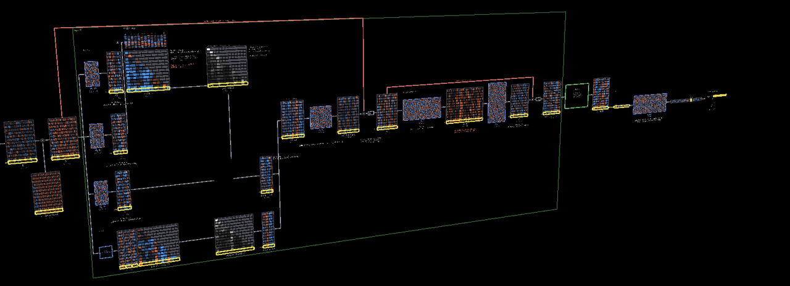
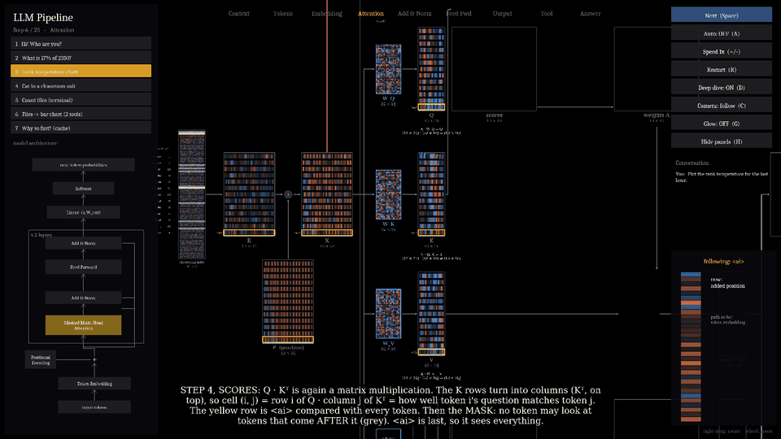
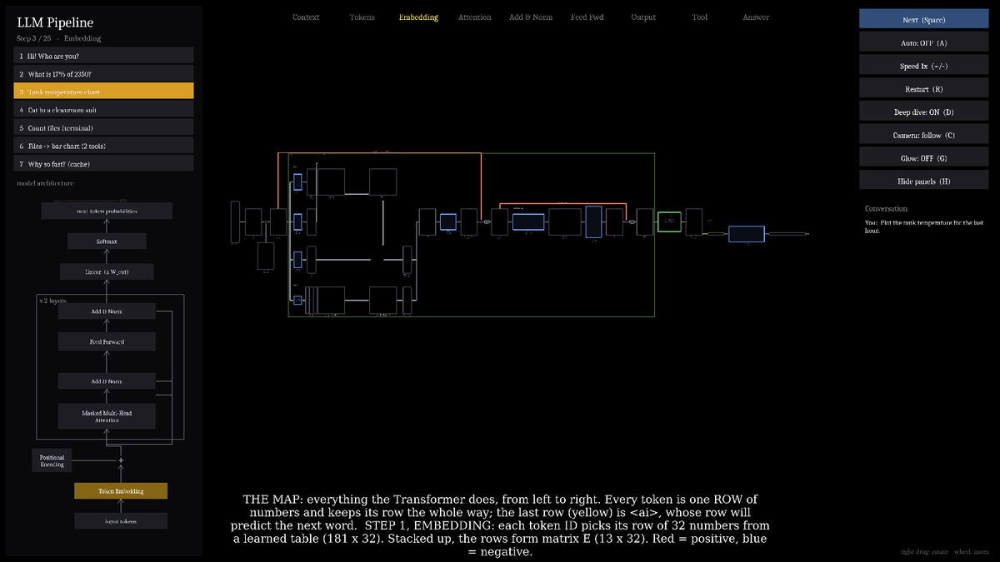
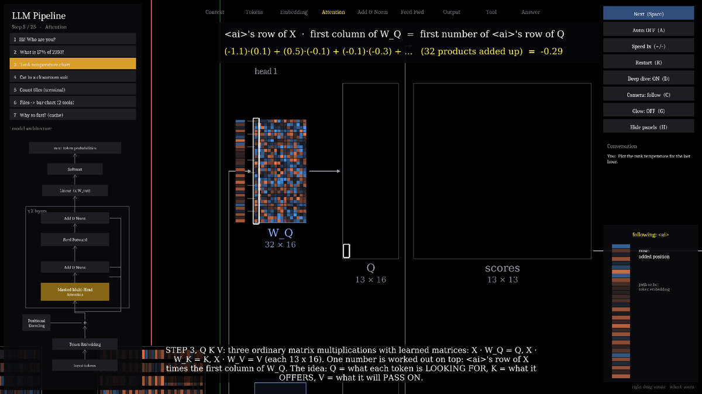
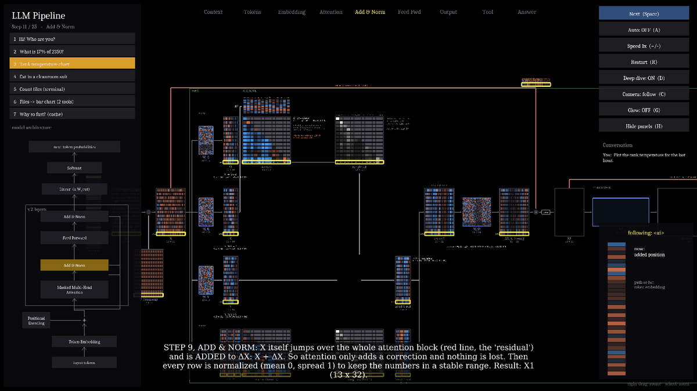
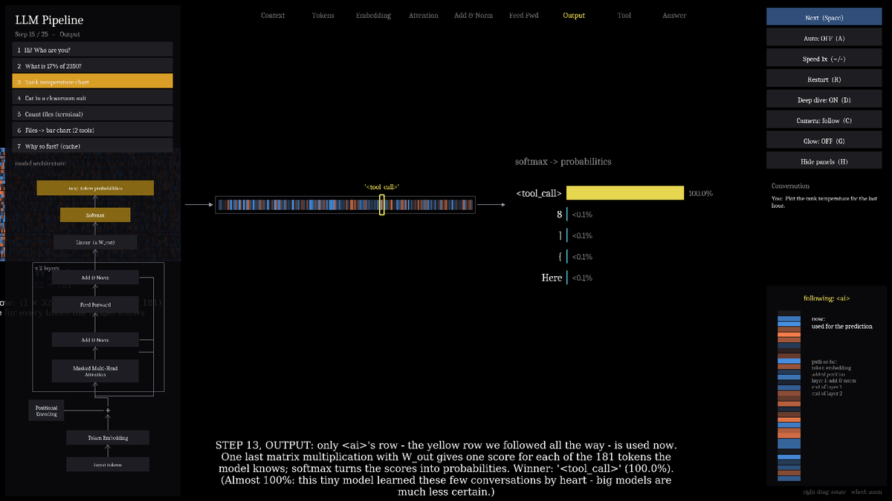
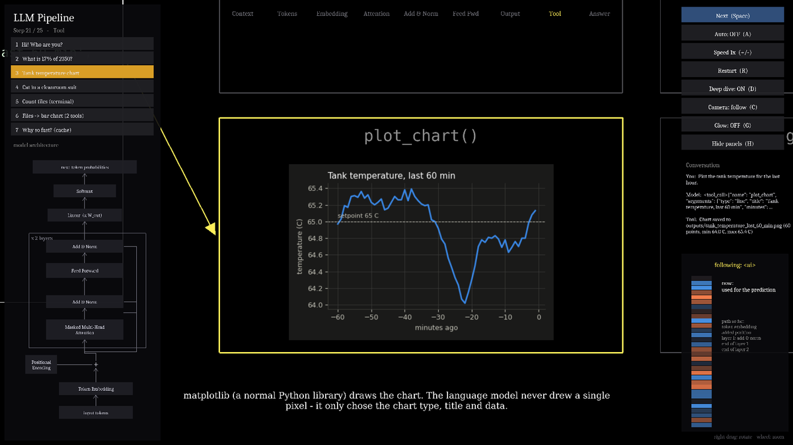
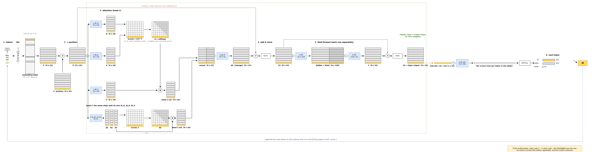

<p align="center">
  
</p>

<h1 align="center">LLM Pipeline — open up a Transformer and watch it think</h1>

<p align="center">
  <b>A 3D classroom demo that follows <i>one</i> token through a real (tiny) GPT, number by number —<br>
  from the sentence you type to the tool call that draws your chart.</b>
</p>

<p align="center">
  
  
  
  
  
</p>

<p align="center">
  
  <br><sub>Step 4 in action: the rows of K turn into the columns of Kᵀ, and Q · Kᵀ fills the score table — real numbers, live.</sub>
</p>

---

**An AI chatbot feels like magic. It isn't.** Under the hood it is a stack of matrix multiplications — and if your
students can multiply two matrices, they can follow *every single step* here.

This demo takes a question like *"Plot the tank temperature for the last hour."*, and shows everything that
happens until the chart appears: the hidden system prompt, the tokens, every matrix inside the Transformer
(with the **actual numbers** of a model trained for this demo), the next-token probabilities, the tool call
the model writes, the real Python code that runs, and the answer.

## Why it works in class

| | |
|---|---|
| 🔍 **No black box** | Every intermediate matrix is on screen: Q, K, V, the score table, the attention weights, the residual stream, the feed-forward layer, the output scores. |
| 🟨 **One token to follow** | Every token is a row of numbers, always in the same place. The last row — `<ai>`, the one that will predict the next word — is framed in yellow from the first step to the last. |
| ➡️ **One straight road** | The whole Transformer is laid out once, left to right, like a circuit diagram. Results stay where they were made; the camera travels. Students always know where they are. |
| ✖️ **Only matrix multiplication needed** | Every `· W` is shown as a matrix product with its shapes. One number is worked out by hand: a row of X stands up next to a column of W_Q, pair by pair, then added up. |
| 🛠 **From words to actions** | The model writes a tool call; a real program runs matplotlib, a calculator or a terminal command, and feeds the result back to the model. |
| 🏫 **Made for teaching** | Step by step or auto play, 7 ready-made questions, English UI, runs offline, one-click start on Windows. |

## A tour in six pictures

<table>
<tr>
<td width="50%"><br><b>1 · The map.</b> Before anything is computed, the whole road is shown as empty frames — then each step fills in its part.</td>
<td width="50%"><br><b>2 · One number by hand.</b> <code>&lt;ai&gt;</code>'s row of X · the first column of W_Q = the first number of its row of Q.</td>
</tr>
<tr>
<td><br><b>3 · The residual.</b> After both attention heads, a copy of X travels along the red line and is added back.</td>
<td><br><b>4 · The prediction.</b> Only the yellow row is used: · W_out → 181 scores → softmax → the next token.</td>
</tr>
<tr>
<td><br><b>5 · The tool runs.</b> The model wrote <code>&lt;tool_call&gt;</code>; the program runs matplotlib. The model never drew a pixel.</td>
<td><br><b>6 · The plan.</b> The whole data flow as one diagram (<code>docs/flow.drawio</code>, editable in draw.io).</td>
</tr>
</table>

## Quick start

### Windows — one click (for students)

1. Install **Python 3.9 or newer** from [python.org](https://www.python.org/downloads/) and tick **"Add python.exe to PATH"**.
2. Download this project (**Code → Download ZIP**) and unzip it.
3. Double-click **`run_windows.bat`**.

The first start installs `panda3d`, `numpy` and `matplotlib` into a private `.venv` folder inside the project
(needs internet, 1–3 minutes). After that it starts immediately and works offline. If something goes wrong,
the black window shows the error and waits. To reinstall, delete the `.venv` folder.

### Any system

```
pip install -r requirements.txt
python main.py
```

### Controls

| Key / mouse | Action |
|---|---|
| Space or → | Next step (press during an animation = skip to its end) |
| A | Auto play on/off |
| + / - | Speed 0.5x – 3x |
| 1 – 7 | Pick a question |
| R | Restart current question |
| D | Deep dive on/off (off = one quick pass through the Transformer) |
| C | Camera follow on/off (off = explore freely) |
| G | Glow on/off (turn off on slow computers) |
| H | Hide/show the side panels (for projecting) |
| Right-drag / wheel | Rotate / zoom |

## What students see

**Before the model** — the hidden system prompt and your message become one context; the tokenizer cuts it
into tokens with IDs.

**Inside the Transformer** — 13 numbered steps along one road:

| Step | What happens | As matrices |
|---|---|---|
| 1 | **Embedding**: each token ID picks its row of a learned table | E (n × 32) |
| 2 | **Position**: a fixed pattern per position is added | X = E + P |
| 3 | **Q, K, V** — one number worked out by hand | X · W_Q, X · W_K, X · W_V (n × 16) |
| 4 | **Scores**: how well each token's question matches each token | Q · Kᵀ ÷ √16, then the mask |
| 5 | **Weights**: softmax, every row adds up to 1 | A (n × n) |
| 6 | **Mix**: each row becomes a weighted sum of the V rows | A · V |
| 7 | **Head 2**: the same with its own matrices | |
| 8 | **Concat · W_O**: the change attention wants to make | ΔX (n × 32) |
| 9 | **Add & norm**: X skips attention and is added back | X1 = norm(X + ΔX) |
| 10 | **Feed forward**: every row on its own, ReLU in between | X1 · W1 → ReLU → · W2 |
| 11 | **Add & norm** again | X2 = layer 1 output |
| 12 | **Layer 2**: the same once more | X3 |
| 13 | **Output**: only `<ai>`'s row | (1 × 32) · W_out → 181 scores → softmax |

**After the model** — the new token is appended and everything runs again. When the model writes
`<tool_call>{...}</tool_call>`, the program runs the real tool, turns the result into tokens, appends it, and the
model writes the answer.

Along the way: the **tracker** (bottom right) shows `<ai>`'s current 32 numbers, and the **architecture map**
(left) lights up the block being shown.

## The 7 questions

| # | Question | What it shows |
|---|---|---|
| 1 | Hi! Who are you? | no tool; the first token is sampled, so "Hi" / "Hello" can change |
| 2 | What is 17% of 2350? | calculator |
| 3 | Plot the tank temperature for the last hour. | matplotlib line chart |
| 4 | Draw a cat wearing a cleanroom suit. | image model (denoising) |
| 5 | How many files are in the demo folder? | a real terminal command |
| 6 | List the files here and make a bar chart by file type. | two tool calls in a row |
| 7 | Why is it fast? | KV cache and prompt-cache hits |

<details>
<summary><b>Question 7: caching, step by step</b></summary>

1. **No cache** – every new token pushes the whole context through the Transformer again (work 10, 11, 12, 13…)
2. **Why reuse** – the attention table grows by only one column; old tokens never look forward, so their K and V never change
3. **KV cache** – prefill once, then one pass per token; old K/V are read from the cache shelf
4. **Memory** – K and V × layers × numbers per token → long chats cost GPU memory
5. **Request 2** – after a tool call the next request starts with the same prefix → cache HIT for the prefix, only the new part is computed
6. **Prefix rule** – change one early token and everything after it misses; keep stable content first, changing content last
</details>

## What is real

* **The model is real.** `tiny/weights.npz` is a tiny GPT (2 layers, 2 heads, 32 numbers per token) trained on
  these conversations (`<sys> <user> question <ai> <tool_call>{json}</tool_call> <tool> result <ai> answer <end>`).
  The demo runs it with numpy and shows its real intermediate matrices. It writes the tool calls and answers
  itself, token by token.
* It is *tiny*: it has learned these few conversations by heart (hence ~100% probabilities) and does not
  understand new questions. Big models are the same machine with far more numbers and layers.
* **The tools are real.** The program parses the JSON, then runs the tool. The terminal really runs one
  read-only whitelisted command (`dir /b /a-d` on Windows, `ls -p` elsewhere) inside `demo_files/`.
  Charts are drawn by matplotlib. The "AI image" is drawn by code; only the denoising is simulated.
  Generated pictures are saved in `outputs/`.
* If you change the files in `demo_files/`, the tool output changes, but the tiny model's answer was learned
  for the original files and may then be wrong.
* Retraining (teacher only, needs `pip install torch`): `python tiny/train.py`.

<details>
<summary><b>Project files</b></summary>

| File | Purpose |
|---|---|
| `main.py` | window, panels (questions, architecture map, conversation, tracker), camera, step player |
| `story.py` | turns a question into animated steps + captions (context, tokens, prediction loop, tools) |
| `tf_steps.py` | inside the Transformer: the fixed left-to-right strip, with the real numbers |
| `docs/` | `flow.drawio` / `flow.png`: the plan of the data flow (`make_flow.py` draws both); `images/` for this page |
| `archmap.py` | the GPT architecture map on the left |
| `engine.py` | runs the whole conversation with the real model and the real tools |
| `tiny/` | the tiny GPT: `model.py` (numpy inference + trace), `data.py`, `train.py`, weights, vocab |
| `cache_story.py` | question 7: KV cache and prompt-cache hits |
| `kit.py` | drawing kit (heatmaps, arrows, token boxes, text) |
| `sim.py` | tokenizer helpers |
| `tools.py` | the four real tools |
| `scenarios.py` | the seven questions |
| `run_windows.bat` | one-click start on Windows |
| `setup.py`, `build_windows.py`, `build-requirements.txt` | an unfinished stand-alone .exe build (not needed) |
| `demo_files/` | sample files the terminal tool lists |
| `style_sample.py` | the standalone style sample |
| `legacy_factory/` | the first version (factory / conveyor-belt look), kept for reference |
</details>

---

<sub>Written with Claude Opus (Claude Opus 写的). Built with Panda3D, numpy and matplotlib.</sub>
